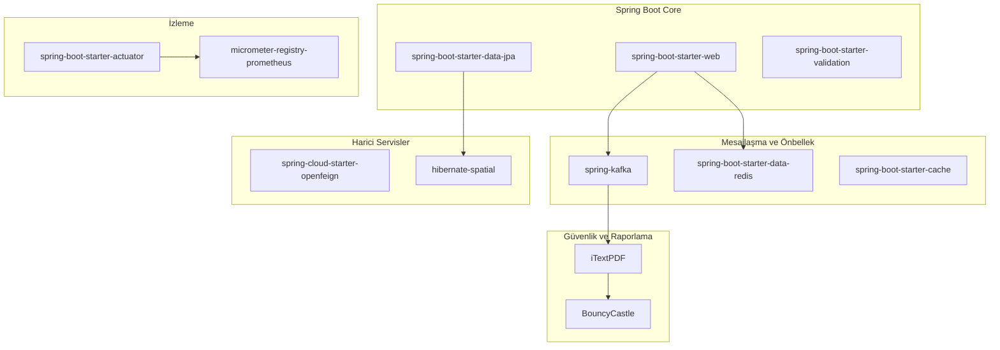
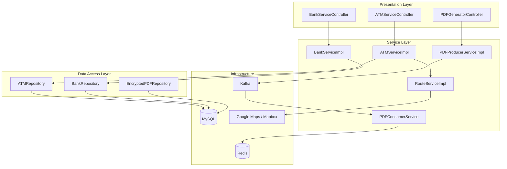
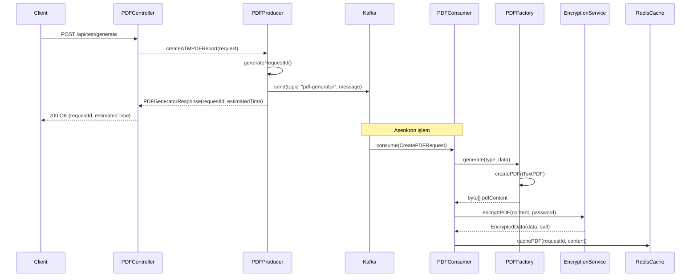
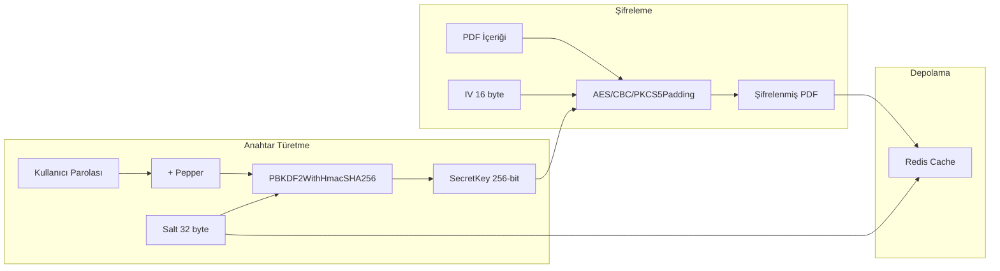
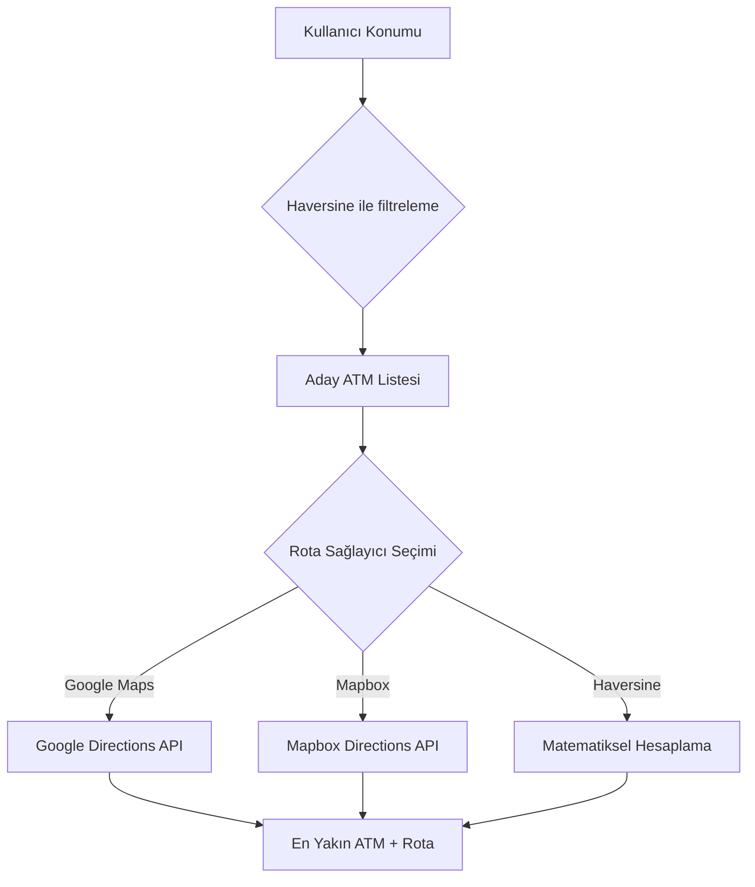
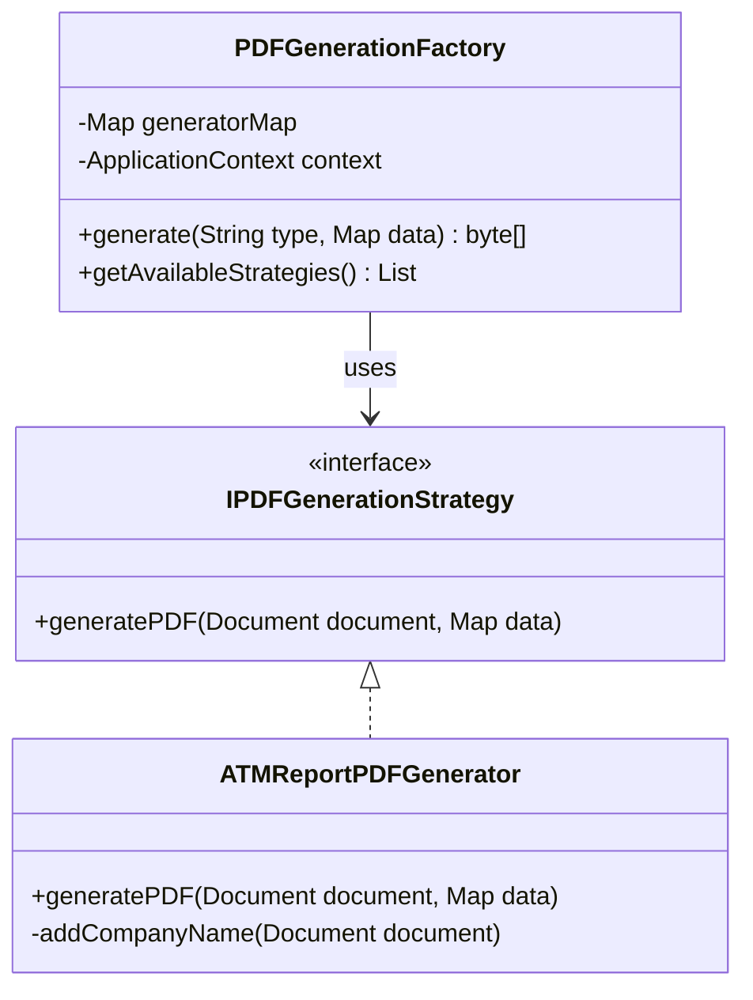

# ATM Reporting Service - Akademik Teknik Rapor

## 1. Giriş ve Proje Tanımı

**ATM Reporting Service**, ModernBank bankacılık ekosisteminin kritik bir bileşeni olarak tasarlanmış, mikroservis mimarisine dayalı bir ATM yönetim ve raporlama sistemidir. Bu servis, banka ATM'lerinin coğrafi konumlandırması, durum izleme, PDF rapor üretimi ve güvenli belge şifreleme işlevlerini tek bir platform altında birleştirmektedir.

### 1.1 Proje Amacı

- Banka müşterilerine en yakın ATM'yi bulma ve rota oluşturma
- ATM'lerin operasyonel durumlarını (para yatırma/çekme) izleme
- Şifrelenmiş PDF raporları asenkron olarak üretme
- Gerçek zamanlı rota hesaplama (Google Maps / Mapbox entegrasyonu)

---

## 2. Teknoloji Yığını (Technology Stack)

| Kategori | Teknoloji | Sürüm |
|----------|-----------|-------|
| **Çatı (Framework)** | Spring Boot | 3.2.0 |
| **Dil** | Java | 17 |
| **Veritabanı** | MySQL + Hibernate Spatial | - |
| **Mesaj Kuyruğu** | Apache Kafka | - |
| **Önbellek** | Redis (Lettuce Client) | - |
| **PDF Üretimi** | iTextPDF | 5.5.13.3 |
| **Şifreleme** | AES-256 CBC + PBKDF2 | - |
| **HTTP İstemci** | OpenFeign | Spring Cloud 2023.0.0 |
| **İzleme** | Micrometer + Prometheus | - |

### 2.1 Bağımlılık Grafiği



---

## 3. Mimari Tasarım

### 3.1 Katmanlı Mimari

Proje, klasik n-katmanlı mimari yaklaşımını benimsemektedir:



### 3.2 Paket Yapısı

```
com.modernbank.atm_reporting_service
├── api/                          # API tanımları ve Feign istemcileri
│   ├── ATMControllerApi.java
│   ├── BankControllerApi.java
│   └── client/
│       └── NotificationServiceClient.java
├── aspect/                       # AOP kesicileri
│   └── BeforeControllerAspect.java
├── config/                       # Yapılandırma sınıfları
│   ├── ApplicationConfiguration.java
│   ├── KafkaConfiguration.java
│   └── RedisConfiguration.java
├── constants/                    # Sabitler
├── exceptions/                   # Özel istisna sınıfları
├── model/
│   ├── dto/                      # Veri transfer nesneleri
│   ├── entity/                   # JPA varlıkları
│   ├── enums/                    # Enumlar
│   └── record/                   # Java Records
├── repository/                   # Spring Data JPA depoları
├── util/                         # Yardımcı sınıflar
├── validator/                    # Doğrulama sınıfları
└── websocket/
    ├── controller/               # REST kontrolcüleri
    └── service/                  # İş mantığı servisleri
        ├── cache/                # Önbellek servisleri
        ├── encryption/           # Şifreleme servisleri
        ├── event/                # Kafka producer/consumer
        ├── invoicegenerator/     # PDF üretim fabrikası
        └── route/                # Rota hesaplama servisleri
```

---

## 4. Temel Bileşenler ve İşlevleri

### 4.1 ATM Varlık Modeli (Entity)

```java
@Entity
@Table(name = "atm")
public class ATM {
    @Id
    @GeneratedValue(strategy = GenerationType.UUID)
    private String id;
    
    private String name;
    private Double latitude;       // Coğrafi enlem
    private Double longitude;      // Coğrafi boylam
    private String city;
    private String district;
    private String address;
    
    private ATMStatus status;              // ACTIVE, INACTIVE, MAINTENANCE
    private ATMDepositStatus depositStatus;    // Para yatırma durumu
    private ATMWithdrawStatus withdrawStatus;  // Para çekme durumu
    
    @ManyToMany(fetch = FetchType.EAGER)
    private Set<Bank> supportedBanks;     // Desteklenen bankalar
}
```

### 4.2 Banka Varlık Modeli

```java
@Entity
@Table(name = "banks")
public class Bank {
    @Id
    @GeneratedValue(strategy = GenerationType.IDENTITY)
    private Long id;
    
    private String name;
    private BankStatus status;
    
    @ManyToMany(mappedBy = "supportedBanks")
    private Set<ATM> atms;        // Bu bankayı destekleyen ATM'ler
}
```

---

## 5. API Endpoint'leri

### 5.1 ATM Servisi Endpoint'leri

| HTTP Metodu | Endpoint | Açıklama |
|-------------|----------|----------|
| `POST` | `/api/v1/atm/create` | Yeni ATM kaydı oluşturma |
| `PUT` | `/api/v1/atm/update` | ATM bilgilerini güncelleme |
| `GET` | `/api/v1/atm/get` | Tüm ATM'leri listeleme |
| `GET` | `/api/v1/atm/status` | ATM durumlarını sorgulama |
| `POST` | `/api/v1/atm/nearest` | En yakın ATM'yi bulma |
| `POST` | `/api/v1/atm/route` | ATM'ye rota oluşturma |

### 5.2 Banka Servisi Endpoint'leri

| HTTP Metodu | Endpoint | Açıklama |
|-------------|----------|----------|
| `POST` | `/api/v1/bank/create` | Yeni banka kaydı oluşturma |
| `PUT` | `/api/v1/bank/update` | Banka bilgilerini güncelleme |
| `PUT` | `/api/v1/bank/activate` | Bankayı aktifleştirme |

### 5.3 PDF Generator Endpoint'leri

| HTTP Metodu | Endpoint | Açıklama |
|-------------|----------|----------|
| `POST` | `/api/test/generate` | PDF raporu üretme isteği |

---

## 6. Kafka Tabanlı Asenkron PDF Üretimi

### 6.1 Mesaj Akış Diyagramı



### 6.2 Kafka Yapılandırması

```java
@Configuration
@EnableKafka
public class KafkaConfiguration {
    
    // Producer Factory - JSON formatında mesaj gönderimi
    @Bean
    public ProducerFactory<String, CreatePDFRequest> pdfProducerFactory() {
        Map<String, Object> configProps = new HashMap<>();
        configProps.put(ProducerConfig.BOOTSTRAP_SERVERS_CONFIG, "localhost:9092");
        configProps.put(ProducerConfig.KEY_SERIALIZER_CLASS_CONFIG, StringSerializer.class);
        configProps.put(ProducerConfig.VALUE_SERIALIZER_CLASS_CONFIG, JsonSerializer.class);
        return new DefaultKafkaProducerFactory<>(configProps);
    }
    
    // Consumer Factory - JSON formatında mesaj alımı
    @Bean
    public ConsumerFactory<String, CreatePDFRequest> pdfConsumerFactory() {
        // Consumer group: "pdf-consumer-group"
        // Topic: "pdf-generator"
    }
}
```

---

## 7. PDF Şifreleme Mekanizması

### 7.1 Güvenlik Mimarisi

Servis, PDF belgelerini **AES-256 CBC** algoritması ile şifrelemektedir. Anahtar türetme işlemi için **PBKDF2WithHmacSHA256** kullanılmaktadır.



### 7.2 Şifreleme Parametreleri

| Parametre | Değer | Açıklama |
|-----------|-------|----------|
| Algoritma | AES/CBC/PKCS5Padding | Simetrik blok şifreleme |
| Anahtar Uzunluğu | 256 bit | Güçlü güvenlik seviyesi |
| Salt Uzunluğu | 32 byte | Gökkuşağı tablo saldırılarına karşı |
| IV Uzunluğu | 16 byte | Başlatma vektörü |
| Iterasyon Sayısı | 65536 | Brute-force saldırılarına karşı |
| Parola Kuralı | `(?=.*[0-9])(?=.*[a-z])(?=.*[A-Z])(?=.*[@#$%^&+=])` | Güçlü parola politikası |

---

## 8. Coğrafi Rota Hesaplama

### 8.1 En Yakın ATM Bulma Algoritması

Servis, iki aşamalı bir yaklaşım kullanmaktadır:

1. **Haversine Formülü**: İlk filtreleme için kuş uçuşu mesafe hesabı
2. **Gerçek Rota API'leri**: Kesin mesafe için Google Maps veya Mapbox



### 8.2 RouteInfo Veri Modeli

```java
public record RouteInfo(
    double distanceMeters,    // Metre cinsinden mesafe
    double durationSeconds,   // Saniye cinsinden süre
    String providerName       // google, mapbox, haversine
) {
    public double getDistanceKm() {
        return distanceMeters / 1000.0;
    }
    
    public int getDurationMinutes() {
        return (int) Math.ceil(durationSeconds / 60.0);
    }
}
```

---

## 9. PDF Üretim Fabrikası (Factory Pattern)

### 9.1 Strategy Pattern Uygulaması

PDF üretimi için **Strategy Design Pattern** kullanılmaktadır:



### 9.2 PDF Üretim Türleri

```java
public enum PDFGenerationTypes {
    ATM_REPORT_INVOICE("ATM_REPORT_INVOICE");
    // Gelecekte eklenebilecek türler:
    // TRANSACTION_REPORT, BANK_STATEMENT, etc.
}
```

---

## 10. Redis Önbellek Stratejisi

### 10.1 Önbellek Yapılandırması

```java
@Configuration
@EnableCaching
public class RedisConfiguration {
    
    @Value("${cache.config.entryTtl:60}")
    private int entryTtl;  // Varsayılan 60 dakika
    
    @Bean
    public RedisCacheConfiguration cacheConfiguration() {
        return RedisCacheConfiguration.defaultCacheConfig()
            .entryTtl(Duration.ofMinutes(entryTtl))
            .disableCachingNullValues()
            .serializeValuesWith(GenericJackson2JsonRedisSerializer);
    }
    
    @Bean
    public RedisTemplate<String, PDFContentData> redisTemplate() {
        // JSON serileştirme ile PDF içerik önbellekleme
    }
}
```

### 10.2 Önbellek Kullanım Senaryoları

| Önbellek Adı | TTL | Kullanım Amacı |
|--------------|-----|----------------|
| `pdfCache` | 30 dakika | Şifrelenmiş PDF belgelerini geçici depolama |
| `errorCache` | 60 dakika | Hata kodlarını önbellekleme |
| `atmReportCache` | 60 dakika | ATM rapor verilerini önbellekleme |

---

## 11. İzleme ve Metrikler (Observability)

### 11.1 Actuator Endpoint'leri

Servis, aşağıdaki izleme endpoint'lerini sunmaktadır:

| Endpoint | Açıklama |
|----------|----------|
| `/actuator/health` | Servis sağlık durumu |
| `/actuator/metrics` | Uygulama metrikleri |
| `/actuator/prometheus` | Prometheus formatında metrikler |

### 11.2 Prometheus Entegrasyonu

```yaml
management:
  endpoints:
    web:
      exposure:
        include: health, metrics, prometheus
  metrics:
    tags:
      application: atm-reporting-service
```

---

## 12. Dağıtım ve Çalıştırma

### 12.1 Ortam Değişkenleri

| Değişken | Açıklama | Örnek Değer |
|----------|----------|-------------|
| `DATABASE_URL` | MySQL bağlantı URL'i | `jdbc:mysql://localhost:3306/atmdb` |
| `DB_USERNAME` | Veritabanı kullanıcı adı | `admin` |
| `DB_PASSWORD` | Veritabanı parolası | `secret` |
| `KAFKA_BOOTSTRAP_SERVERS` | Kafka broker adresi | `localhost:9092` |
| `REDIS_HOST` | Redis sunucu adresi | `localhost` |
| `REDIS_PORT` | Redis port numarası | `6379` |
| `REDIS_PASSWORD` | Redis parolası | `redispass` |
| `ENCRYPTION_PEPPER` | Şifreleme pepper değeri | `secret-pepper` |
| `ROUTE_PROVIDER` | Rota sağlayıcı | `google`, `mapbox`, `haversine` |
| `GOOGLE_MAPS_API_KEY` | Google Maps API anahtarı | - |
| `MAPBOX_ACCESS_TOKEN` | Mapbox erişim tokeni | - |

### 12.2 Docker Desteği

```dockerfile
FROM openjdk:17-jdk-slim
COPY target/*.jar app.jar
ENTRYPOINT ["java", "-jar", "/app.jar"]
```

### 12.3 Servis Portu

Servis varsayılan olarak **8085** portunda çalışmaktadır.

---

## 13. Sonuç

**ATM Reporting Service**, modern mikroservis mimarisi prensiplerini takip eden, güvenlik odaklı ve ölçeklenebilir bir bankacılık altyapı bileşenidir. Kafka ile asenkron işlem kuyruğu, Redis ile performans optimizasyonu, AES-256 ile veri güvenliği ve çoklu rota sağlayıcı entegrasyonu ile kapsamlı bir çözüm sunmaktadır.

### 13.1 Temel Özellikler Özeti

- ✅ **Coğrafi ATM Yönetimi**: Konum tabanlı ATM arama ve rota oluşturma
- ✅ **Asenkron PDF Üretimi**: Kafka tabanlı mesaj kuyruğu
- ✅ **Güvenli Belge Şifreleme**: AES-256 + PBKDF2
- ✅ **Redis Önbellekleme**: Performans optimizasyonu
- ✅ **Çoklu Rota Sağlayıcı**: Google Maps, Mapbox, Haversine
- ✅ **Prometheus Metrikleri**: Kapsamlı izleme altyapısı

---

## 14. Referanslar

- [Spring Boot 3.2 Documentation](https://docs.spring.io/spring-boot/docs/3.2.0/reference/html/)
- [Apache Kafka Documentation](https://kafka.apache.org/documentation/)
- [Redis Documentation](https://redis.io/documentation)
- [iTextPDF Documentation](https://itextpdf.com/en/resources/api-documentation)
- [Google Maps Directions API](https://developers.google.com/maps/documentation/directions)
- [Mapbox Directions API](https://docs.mapbox.com/api/navigation/directions/)

---

**Hazırlayan**: Ataberk BAKIR 
**Tarih**: Ocak 2026  
**Versiyon**: 1.0.0
